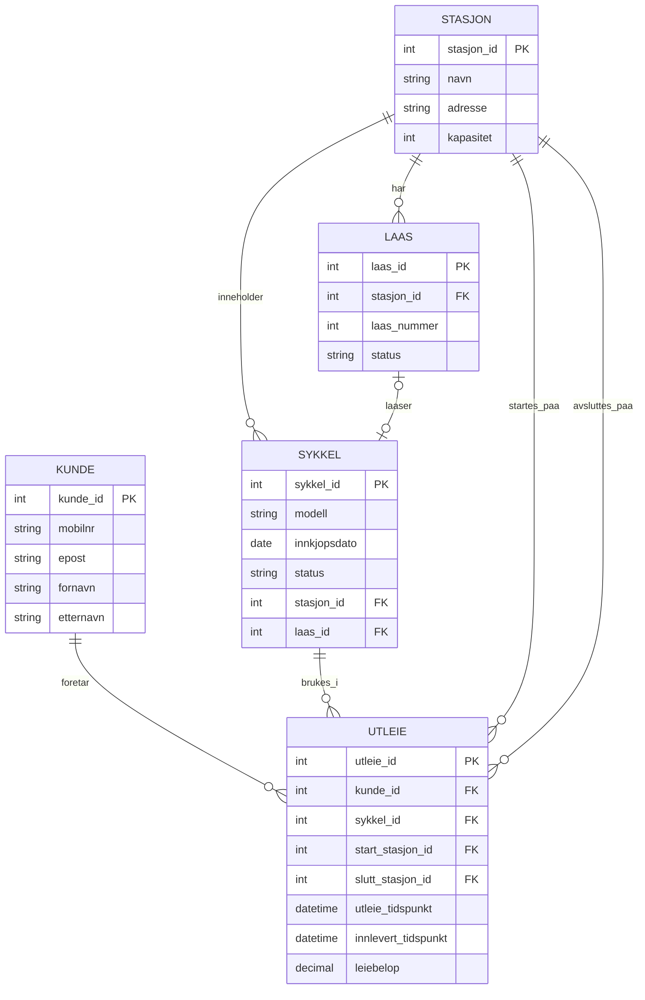

# Besvarelse - Refleksjon og Analyse

**Student:** [Yahya Abikar]

**Studentnummer:** [407559]

**Dato:** [19, Mars]

---

## Del 1: Datamodellering

### Oppgave 1.1: Entiteter og attributter

**Identifiserte entiteter:**

Jeg har identifisert følgende sentrale entiteter i systemet:

Kunde

Stasjon

Laas

Sykkel

Utleie

Jeg har valgt disse entitetene fordi de dekker de viktigste delene av caset. Kundene registrerer seg i systemet, sykler står ved stasjoner og festes i låser, og utleie registrerer selve leieforholdet fra oppstart til innlevering.

Attributter for hver entitet:

Kunde

kunde_id

mobilnr

epost

fornavn

etternavn

Stasjon

stasjon_id

navn

adresse

kapasitet

Laas

laas_id

stasjon_id

laas_nummer

status

Sykkel

sykkel_id

modell

innkjopsdato

status

stasjon_id

laas_id

Utleie

utleie_id

kunde_id

sykkel_id

start_stasjon_id

slutt_stasjon_id

utleie_tidspunkt

innlevert_tidspunkt

leiebelop

---

### Oppgave 1.2: Datatyper og `CHECK`-constraints

**Valgte datatyper og begrunnelser:**

Jeg har brukt SERIAL til primærnøkler fordi det er en enkel måte å få unike ID-er på.

I Kunde har jeg brukt:

kunde_id SERIAL

mobilnr VARCHAR(15) fordi telefonnummer er tekst og kan ha ulik lengde

epost VARCHAR(100) fordi e-post er tekst

fornavn VARCHAR(50)

etternavn VARCHAR(50)

I Stasjon har jeg brukt:

stasjon_id SERIAL

navn VARCHAR(100)

adresse VARCHAR(150)

kapasitet INTEGER

I Laas har jeg brukt:

laas_id SERIAL

stasjon_id INTEGER

laas_nummer INTEGER

status VARCHAR(20)

I Sykkel har jeg brukt:

sykkel_id SERIAL

modell VARCHAR(50)

innkjopsdato DATE

status VARCHAR(20)

stasjon_id INTEGER

laas_id INTEGER

I Utleie har jeg brukt:

utleie_id SERIAL

kunde_id INTEGER

sykkel_id INTEGER

start_stasjon_id INTEGER

slutt_stasjon_id INTEGER

utleie_tidspunkt TIMESTAMP

innlevert_tidspunkt TIMESTAMP

leiebelop NUMERIC(8,2)

Jeg synes disse datatypene passer godt fordi de er enkle og passer til informasjonen som skal lagres. For eksempel brukes TIMESTAMP når både dato og klokkeslett er viktig, og NUMERIC brukes for beløp.

CHECK-constraints:

Jeg har lagt til disse CHECK-constraintene:

mobilnr må ligne et gyldig telefonnummer

epost må ligne en gyldig e-postadresse

kapasitet > 0

laas_nummer > 0

status i Laas må være en av 'ledig', 'opptatt', 'defekt'

status i Sykkel må være en av 'tilgjengelig', 'utleid', 'service', 'defekt'

leiebelop >= 0

innlevert_tidspunkt >= utleie_tidspunkt OR innlevert_tidspunkt IS NULL

Jeg har brukt disse for å hindre ugyldige data i databasen. 



---

### Oppgave 1.3: Primærnøkler

**Valgte primærnøkler og begrunnelser:**

Jeg har valgt disse primærnøklene:

Kunde: kunde_id

Stasjon: stasjon_id

Laas: laas_id

Sykkel: sykkel_id

Utleie: utleie_id

Jeg valgte disse fordi de er enkle, unike og passer godt som koblinger mellom tabellene.

**Naturlige vs. surrogatnøkler:**

Jeg har brukt surrogatnøkler. Jeg kunne for eksempel brukt e-post som naturlig nøkkel i Kunde, men e-post kan endres. Derfor er det tryggere å bruke en egen ID som primærnøkkel.

**Oppdatert ER-diagram:**


---

### Oppgave 1.4: Forhold og fremmednøkler

**Identifiserte forhold og kardinalitet:**

Jeg har identifisert disse forholdene:

En stasjon har mange låser

En stasjon kan ha mange sykler

En lås kan ha null eller én sykkel

En kunde kan ha mange utleier

En sykkel kan være med i mange utleier over tid

En utleie starter på én stasjon og kan slutte på én stasjon

Kardinalitet:

Stasjon til Laas: 1 til mange

Stasjon til Sykkel: 1 til mange

Laas til Sykkel: 1 til 0/1

Kunde til Utleie: 1 til mange

Sykkel til Utleie: 1 til mange

**Fremmednøkler:**

Jeg har brukt disse fremmednøklene:

laas.stasjon_id → stasjon.stasjon_id

sykkel.stasjon_id → stasjon.stasjon_id

sykkel.laas_id → laas.laas_id

utleie.kunde_id → kunde.kunde_id

utleie.sykkel_id → sykkel.sykkel_id

utleie.start_stasjon_id → stasjon.stasjon_id

utleie.slutt_stasjon_id → stasjon.stasjon_id

Disse fremmednøklene gjør at tabellene henger riktig sammen og at databasen ikke kan lagre ugyldige koblinger.

**Oppdatert ER-diagram:**


---

### Oppgave 1.5: Normalisering

**Vurdering av 1. normalform (1NF):**

Modellen er på 1NF fordi alle feltene inneholder én verdi hver. Jeg har ikke brukt lister eller flere verdier i samme kolonne.

**Vurdering av 2. normalform (2NF):**

Modellen er på 2NF fordi alle tabellene har en enkel primærnøkkel. Derfor finnes det ikke delvise avhengigheter.

**Vurdering av 3. normalform (3NF):**

Modellen er på 3NF fordi informasjon er delt opp i egne tabeller. Kundeinformasjon ligger i kunde, stasjonsinformasjon ligger i stasjon, og historikk for leie ligger i utleie. Dermed unngår jeg unødvendig repetisjon.

**Eventuelle justeringer:**

Jeg gjorde modellen tydeligere ved å skille mellom hvor sykkelen står nå og historikken for tidligere utleier. Nåværende plassering ligger i sykkel, mens gamle og aktive leieforhold ligger i utleie.

---

## Del 2: Database-implementering

### Oppgave 2.1: SQL-skript for database-initialisering

**Plassering av SQL-skript:**

Jeg har lagt SQL-skriptet i init-scripts/01-init-database.sql

**Antall testdata:**

- Kunder: [5]
- Sykler: [100]
- Sykkelstasjoner: [5]
- Låser: [100]
- Utleier: [50]

---

### Oppgave 2.2: Kjøre initialiseringsskriptet

**Dokumentasjon av vellykket kjøring:**

Jeg startet PostgreSQL-databasen med docker compose up build. Deretter koblet jeg meg til databasen med psql ved å bruke brukeren admin og databasen oblig01. Jeg verifiserte at databasen var opprettet og tilgjengelig ved å kjøre en spørring mot information_schema.tables for å liste alle basetabeller i public-schemaet. 


**Spørring mot systemkatalogen:**

```sql
SELECT table_name 
FROM information_schema.tables 
WHERE table_schema = 'public' 
  AND table_type = 'BASE TABLE'
ORDER BY table_name;
```

**Resultat:**

```
app_user_kunde
kunde
laas
stasjon
sykkel
utleie
```

---

## Del 3: Tilgangskontroll

### Oppgave 3.1: Roller og brukere

**SQL for å opprette rolle:**

```sql
CREATE ROLE kunde NOINHERIT;
```

**SQL for å opprette bruker:**

```sql
CREATE USER kunde_1 WITH PASSWORD 'kunde123';
GRANT kunde TO kunde_1;
```

**SQL for å tildele rettigheter:**

```sql
GRANT CONNECT ON DATABASE oblig01 TO kunde;
GRANT USAGE ON SCHEMA public TO kunde;

GRANT SELECT ON TABLE stasjon TO kunde;
GRANT SELECT ON TABLE sykkel TO kunde;
GRANT SELECT ON TABLE laas TO kunde;
```

---

### Oppgave 3.2: Begrenset visning for kunder

**SQL for VIEW:**

```
CREATE VIEW v_mine_utleier AS
SELECT
    u.utleie_id,
    u.sykkel_id,
    s1.navn AS start_stasjon,
    s2.navn AS slutt_stasjon,
    u.utleie_tidspunkt,
    u.innlevert_tidspunkt,
    u.leiebelop
FROM utleie u
JOIN app_user_kunde a ON u.kunde_id = a.kunde_id
JOIN stasjon s1 ON u.start_stasjon_id = s1.stasjon_id
LEFT JOIN stasjon s2 ON u.slutt_stasjon_id = s2.stasjon_id
WHERE a.username = CURRENT_USER;

GRANT SELECT ON v_mine_utleier TO kunde;
```

**Ulempe med VIEW vs. POLICIES:**

En ulempe med VIEW er at det kan bli mer tungvint å vedlikeholde når det kommer mange brukere. Hvis hver kunde bare skal se sine egne rader, kan man fort trenge ekstra logikk eller flere views. POLICIES med row-level security er ofte bedre fordi databasen da kan filtrere rader automatisk per bruker.

---

## Del 4: Analyse og Refleksjon

### Oppgave 4.1: Lagringskapasitet

**Gitte tall for utleierate:**

Høysesong (mai-september): 20000 utleier/måned

Mellomsesong (mars, april, oktober, november): 5000 utleier/måned

Lavsesong (desember-februar): 500 utleier/måned

**Totalt antall utleier per år:**

Høysesong:
5 × 20000 = 100000

Mellomsesong:
4 × 5000 = 20000

Lavsesong:
3 × 500 = 1500

Totalt per år:
100000 + 20000 + 1500 = 121500 utleier

**Estimat for lagringskapasitet:**

20000 kunder

2000 sykler

100 stasjoner

2500 låser

121500 utleier

Omtrentlig radstørrelse:

Kunde: ca. 150 byte

Sykkel: ca. 80 byte

Stasjon: ca. 120 byte

Laas: ca. 32 byte

Utleie: ca. 80 byte

Utregning:

Kunde: 20000 × 150 = 3 000 000 byte ≈ 2,86 MB

Sykkel: 2000 × 80 = 160 000 byte ≈ 0,15 MB

Stasjon: 100 × 120 = 12 000 byte ≈ 0,01 MB

Laas: 2500 × 32 = 80 000 byte ≈ 0,08 MB

Utleie: 121500 × 80 = 9 720 000 byte ≈ 9,27 MB

**Totalt for første år:**

Jeg antar omtrent følgende radstørrelser: Kunde ca. 150 byte, Sykkel ca. 80 byte, Stasjon ca. 120 byte, Laas ca. 32 byte og Utleie ca. 80 byte. Med 20000 kunder, 2000 sykler, 100 stasjoner, 2500 låser og 121500 utleier blir det omtrent 12,37 MB data første år. Dette er uten å regne med all overhead, indekser og metadata. 

---

### Oppgave 4.2: Flat fil vs. relasjonsdatabase

**Analyse av CSV-filen (`data/utleier.csv`):**

**Problem 1: Redundans**

CSV-filen har mye gjentatt informasjon. For eksempel kommer samme kunder igjen flere ganger med samme navn, telefonnummer og e-post. Det samme gjelder stasjonsnavn og adresser.

**Problem 2: Inkonsistens**

Når samme informasjon ligger flere ganger, kan det lett bli feil. Hvis en kunde endrer e-post, må alle radene oppdateres. Hvis noen rader ikke blir oppdatert, får man ulike verdier for samme kunde.

**Problem 3: Oppdateringsanomalier**

Oppdateringsanomali: én endring må gjøres mange steder

Innsettingsanomali: det er vanskelig å legge inn en ny stasjon uten å ha en utleie samtidig

Sletteanomali: hvis en rad slettes, kan viktig informasjon om kunde eller stasjon forsvinne

**Fordeler med en indeks:**

En indeks gjør det raskere å finne rader, for eksempel alle utleier for en bestemt sykkel eller kunde.

**Case 1: Indeks passer i RAM**

Hvis indeksen får plass i minnet, går oppslag raskt fordi databasen slipper mange disklesinger.

**Case 2: Indeks passer ikke i RAM**

Hvis indeksen er større enn minnet, må databasen lese mer fra disk. Ved store datamengder kan flettesortering brukes for å håndtere sortering i flere steg.

**Datastrukturer i DBMS:**

B+-trær passer godt fordi de fungerer både for eksakte søk og intervallsøk. Hash-indekser passer best til eksakte oppslag, men ikke like godt til intervaller.

---

### Oppgave 4.3: Datastrukturer for logging

**Foreslått datastruktur:**

LSM-tree

**Begrunnelse:**

**Skrive-operasjoner:**

LSM-tree passer godt når systemet skriver mye data. Nye data kan skrives raskt og senere flettes sammen på en effektiv måte.

**Lese-operasjoner:**

Lesing kan være litt tregere enn med noen andre strukturer, men siden oppgaven sier at leseoperasjoner er sjeldne, er dette et greit valg.

---

### Oppgave 4.4: Validering i flerlags-systemer

**Hvor bør validering gjøres:**

Validering bør gjøres flere steder: i nettleseren, i applikasjonen og i databasen.

**Validering i nettleseren:**

Fordelen er at brukeren får rask beskjed om feil. Ulempen er at dette ikke er sikkert nok alene.

**Validering i applikasjonslaget:**

Her kan man sjekke forretningsregler, som om en sykkel faktisk er ledig. Dette er viktig fordi applikasjonen har kontroll på logikken.

**Validering i databasen:**

Databasen bør også validere data med NOT NULL, CHECK, UNIQUE og FOREIGN KEY, slik at ugyldige data ikke blir lagret.

**Konklusjon:**

Det beste er å bruke validering i flere lag. Da får brukeren rask tilbakemelding, og databasen beskytter samtidig datakvaliteten.

---

### Oppgave 4.5: Refleksjon over læringsutbytte

**Hva har du lært så langt i emnet:**

Jeg har lært mer om hvordan man designer en database fra bunnen av. Jeg har fått bedre forståelse for tabeller, nøkler, relasjoner og normalisering.

**Hvordan har denne oppgaven bidratt til å oppnå læringsmålene:**

Oppgaven gjorde teorien mer praktisk. Jeg måtte faktisk lage en modell, skrive SQL og teste at databasen fungerte.

Se oversikt over læringsmålene i en PDF-fil i Canvas https://oslomet.instructure.com/courses/33293/files/folder/Plan%20v%C3%A5ren%202026?preview=4370886

**Hva var mest utfordrende:**

Det mest utfordrende var å finne en modell som både var enkel og riktig. Det var også litt krevende å få alt til å stemme mellom tabeller, fremmednøkler og SQL-skript.

**Hva har du lært om databasedesign:**

Jeg har lært at det er viktig å planlegge godt før man lager tabellene.

---

## Del 5: SQL-spørringer og Automatisk Testing

**Plassering av SQL-spørringer:**

Jeg har lagt SQL-spørringene i test-scripts/queries.sql.


**Eventuelle feil og rettelser:**

Jeg måtte rette noen spørringer slik at de brukte riktige tabellnavn og kolonnenavn fra databasen. Jeg måtte også passe på at tabellene ble opprettet i riktig rekkefølge i 01-init-database.sql, slik at fremmednøklene virket.

---

## Del 6: Bonusoppgaver (Valgfri)

### Oppgave 6.1: Trigger for lagerbeholdning

**SQL for trigger:**

```sql
[Skriv din SQL-kode for trigger her, hvis du har løst denne oppgaven]
```

**Forklaring:**

[Skriv ditt svar her - forklar hvordan triggeren fungerer]

**Testing:**

[Skriv ditt svar her - vis hvordan du har testet at triggeren fungerer som forventet]

---

### Oppgave 6.2: Presentasjon

**Lenke til presentasjon:**

[Legg inn lenke til video eller presentasjonsfiler her, hvis du har løst denne oppgaven]

**Hovedpunkter i presentasjonen:**

[Skriv ditt svar her - oppsummer de viktigste punktene du dekket i presentasjonen]

---

**Slutt på besvarelse**
